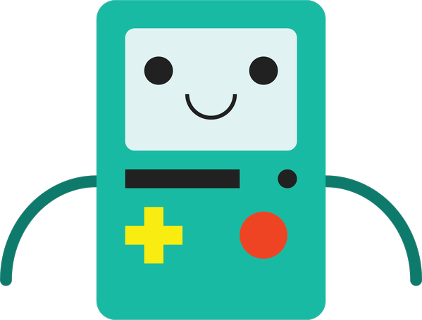
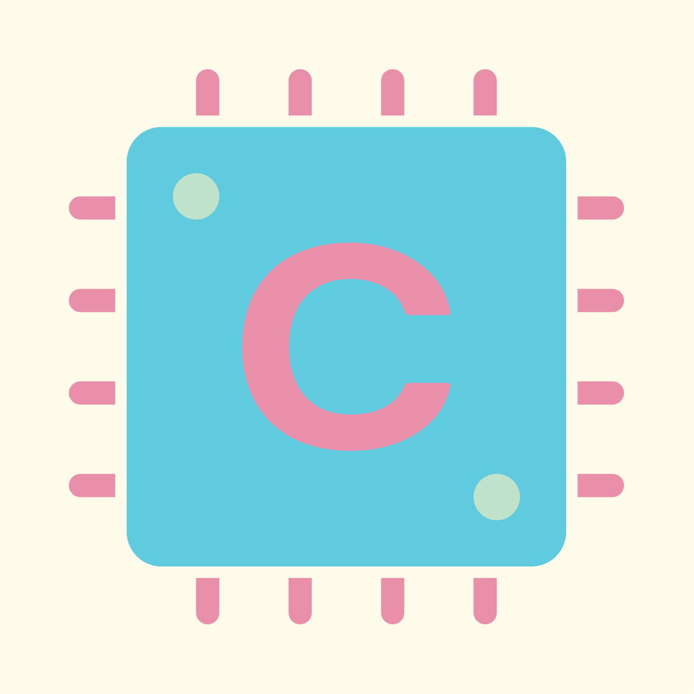

<h1 align="center">
   
  
   
  Compy
   
</h1>

<h4 align="center">A 2D adventure game built using <a href="https://developer.apple.com/documentation/spritekit/" target="_blank">SpriteKit</a> framework.</h4>

  <a href="#main-technologies">Main Technologies</a> •
  <a href="#how-to-play">How To Play</a> •
  <a href="#notes">Notes</a> •
  <a href="#license">License</a>

## Main Technologies

This software uses the following main technologies:

 

## How To Play

Use **iphones** and **ipads** of any screen size to play. Click on the Compy icon to start the game. You will be greeted by the main menu. Here you have to touch the play button to start the game.

