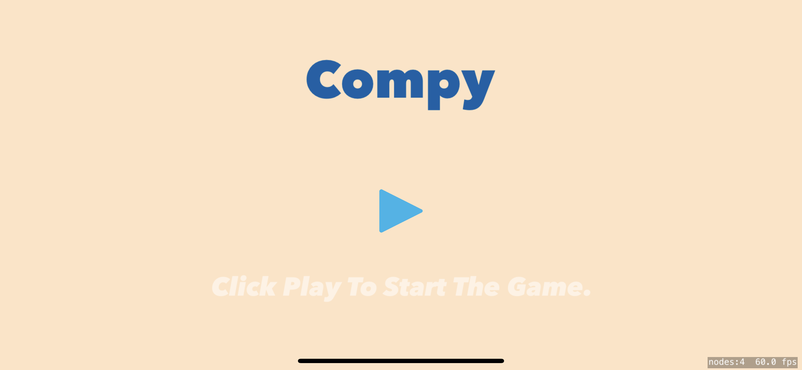
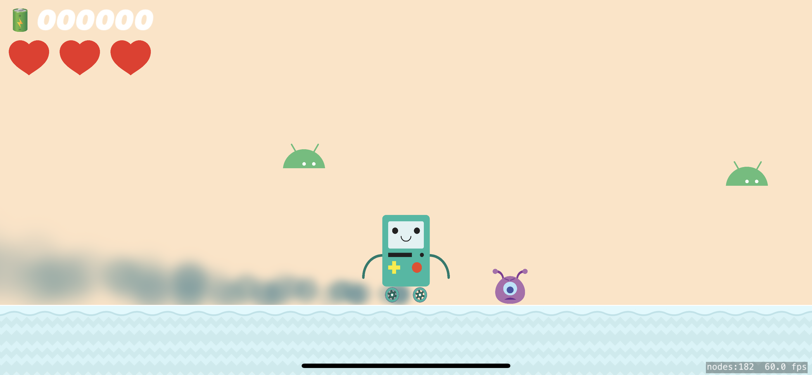
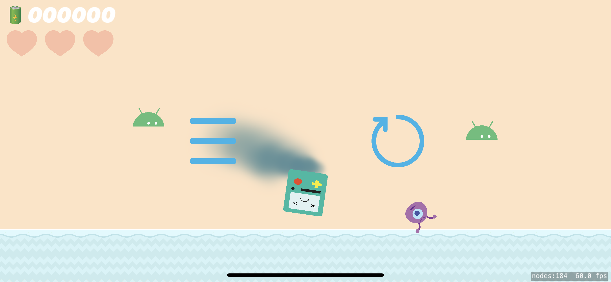

<h1 align="center">
   
  
   
  Compy
   
</h1>

<h4 align="center">A 2D adventure game built using <a href="https://developer.apple.com/documentation/spritekit/" target="_blank">SpriteKit</a> framework in swift.</h4>

  <a href="#main-technologies">Main Technologies</a> •
  <a href="#how-to-play">How To Play</a> •
  <a href="#notes">Notes</a> •
  <a href="#license">License</a>

## Main Technologies

This software uses the following main technologies:
 

 

## How To Play

Use an **iphone** or **ipad** of any screen size to play. Click on the Compy icon to start the game. You will be greeted by the main menu. Here you have to touch the play button to start the game.

Once in the main game scene, you can move Compy left and right by using the internal accelerometer. You can tilt your device right to move Compy right and vice-versa. Collect batteries to increase your score and avoid aliens and droids at all cost! Just for fun you can push one of the droids into the abyss :)

If you are one of us unlucky ones, your Compy will die on your first try. But don't worry because you can always try again ;)

## Notes

Feel free to download the project and build upon it. You can add new features, refactor the code if you'd like and improve the overall experience. Happy coding!

## License

Distributed under the MIT License. See LICENSE for more information.
 

